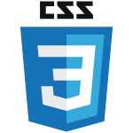

<h2 align="center">👋 Hi there</h2>

<p align="center"> 
  
</p>

```js
{
  age: 18,
  name: "arviixzuh",
  favLang: "typescript",
  country: "Venezuela",
  currentLearning: "GO lang"
}
```
<br><br>

<h2 align="center">☕ Statistics</h2>

<p align="center">
  
  
  
</p>

<p align="center">
    
</p>

<h2 align="center">💻 Skills</h2>
<p align="center">Languages and tools I have worked with</p>

<div align="center">
  
  
  
  
  
  
  
  
  
  
  
  
  
  
  
  
  
  
  
  
  
  
</div>
<br><br><br><br>

[discord]: https://discord.gg/U8APdjGQNq
[twitter]: https://twitter.com/Arviixzuh_
[youtube]: https://www.youtube.com/channel/UCSAafU0GMeeVK_wcmyrWAMg
[instagram]: https://www.instagram.com/arviixzuh/

[][discord]
[][twitter]
[][youtube]

**[Arviixzuh](https://arviixzuh.vercel.app/)**
