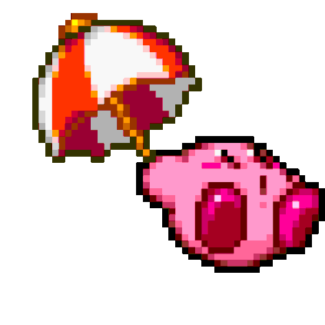
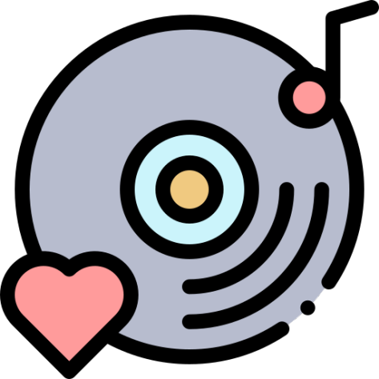

  

# Hello there 👋

My name is **Victor**, I am 18 years old, I live in Venezuela and
I am studying systems engineering 💻☁️🔒 (the path of stress according to many)

 
  

  
<h2 align="center">Projects</h2>

Take a look at my projects.

  
| <a href="https://discord.com/oauth2/authorize?client_id=908862622672236635&scope=bot&permissions=8" target="_blank">**Gunter**</a> | <a href="https://arviixzuh.github.io/My-Symphony/" target="_blank">**My Symphony**</a> | <a href="https://arviixzuh.github.io/Easy-Translate/" target="_blank">**Easy Translate**</a> | <a href="@" target="_blank">**Undefined**</a> | 
| :---: | :---: | :---: | :---: |
 |   |  |  |

<h2 align="center">Skills</h2>

Languages and tools I have worked with

  
  
  
  
  
  
  
  
  
  
  
  
  
  
  
  
  
  

    

[discord]: https://discord.gg/U8APdjGQNq
[twitter]: https://twitter.com/Arviixzuh_
[youtube]: https://www.youtube.com/channel/UCSAafU0GMeeVK_wcmyrWAMg
[instagram]: https://www.instagram.com/arviixzuh/

[][discord]
[][twitter]
[][youtube]

**[Arviixzuh](https://github.com/Arviixzuh)**
